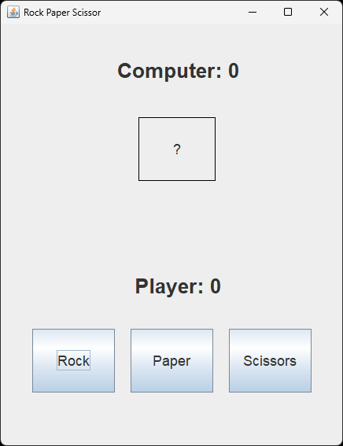

# Rock Paper Scissors Game

This project is a simple Rock Paper Scissors game implemented using Java Swing for the graphical user interface (GUI). The game allows users to play Rock Paper Scissors against the computer, which makes random choices.

## Features

- **Play Rock Paper Scissors**: Users can select rock, paper, or scissors.
- **Random Computer Choice**: The computer randomly chooses rock, paper, or scissors.
- **Score Tracking**: The game keeps track of the user and computer scores.
- **Graphical User Interface**: Built with Java Swing for a user-friendly experience.

## Getting Started

To get a local copy up and running, follow these steps.

### Prerequisites

- Java Development Kit (JDK) installed on your machine.
- An Integrated Development Environment (IDE) like IntelliJ IDEA, Eclipse, or NetBeans (optional).

### Installation

1. Clone the repository
   ```sh
   git clone https://github.com/ashutoshh-17/rock-paper-scissors.git
   ```
2. Navigate to the project directory
   ```sh
   cd rock-paper-scissors
   ```
3. Open the project in your IDE (optional).

### Usage

1. Compile the Java files.
   ```sh
   javac src/com/example/rockpaperscissors/*.java
   ```
2. Run the game.
   ```sh
   java -cp src com.example.rockpaperscissors.Main
   ```

## Files

- `src/com/example/rockpaperscissor/App.java`: The main entry point of the game.
- `src/com/example/rockpaperscissor/RockPaperScissor.java`: The game logic and core functionality.
- `src/com/example/rockpaperscissor/RockPaperScissorGUI.java`: The Swing GUI implementation for the game.

## Code Overview

### Main.java

The main class initializes the game window and starts the application.

### Game.java

This class contains the core logic of the game, including determining the winner and keeping track of the scores.

### GameWindow.java

This class is responsible for creating and managing the GUI using Java Swing. It handles user interactions and updates the interface based on the game state.

## Screenshots

### Main Interface



## Contributing

Contributions are what make the open-source community such an amazing place to learn, inspire, and create. Any contributions you make are **greatly appreciated**.

This README file provides an overview and setup instructions for the Rock Paper Scissors Game. If you have any questions or need further assistance, feel free to reach out. Enjoy playing the game!
